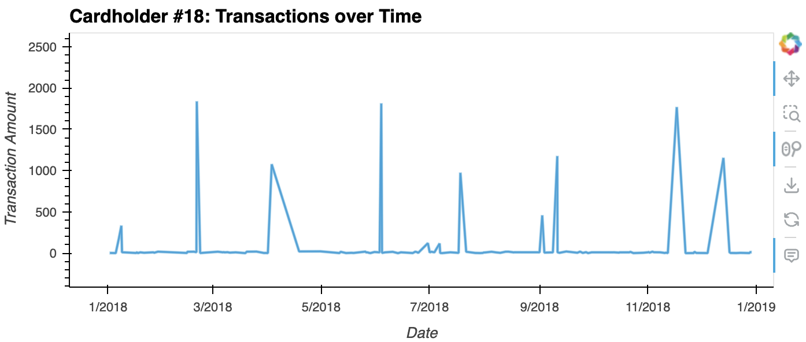

# Unit 7 Homework Assignment: Looking for Suspicious Transactions

## Files

* [schema_query.sql](Submission/schema_query.sql) 
* [views_query.sql](Submission/views_query.sql) 
* [card_holder.csv](Data/card_holder.csv)
* [credit_card.csv](Data/credit_card.csv)
* [merchant.csv](Data/merchant.csv)
* [merchant_category.csv](Data/merchant_category.csv)
* [transaction.csv](Data/transaction.csv)
* [visual_data_analysis.ipynb](Submission/visual_data_analysis.ipynb)
* [challenge.ipynb](Submission/challenge.ipynb)

## Resources Used
* [CASE WHEN FUNCTION](https://www.w3schools.com/sql/sql_case.asp)
* [FORMAT AS PERCENT](https://stackoverflow.com/questions/30089490/format-number-as-percent-in-ms-sql-server)
* [EXTRACTING HOUR FROM DATE](https://www.w3schools.com/sql/func_mysql_extract.asp)
* [EXTRACTING MONTH FROM DATE PYTHON](https://stephenallwright.com/python-month-number/#:~:text=In%20order%20to%20get%20the,multiple%20interpretations%20of%20the%20aggregation.)
* [ITERATE OVER ROWS AND CHANGE DATE TO MONTH](https://stackoverflow.com/questions/16476924/how-to-iterate-over-rows-in-a-dataframe-in-pandas)

## Instructions

### Data Modeling

I created an entity relationship diagram (ERD) by inspecting the provided CSV files.
* There were 5 tables to be combined
* Transactions is the base table that should be referenced
* Transactions branches out to connect to Credit Cards via Credit Card Number and Merchants via Merchant ID
* Card Holders is connected to Credit Card Number by Card Holder ID
* Merchant Category is connected to Merchants via Merchant Category ID

### Data Engineering

Using my database model as a blueprint, I created a database schema for each of my tables and relationships. I  specified my data types, primary keys, foreign keys, and all columns I defined.

I imported the data from the corresponding CSV files via the Import/Export tool with header checked on and delimiter on "," (see SQL file).  I imported in this order: merchant_category, merchant, card_holders, credit_cards, transactions.

I created a view "combined_data_set"

### Data Analysis
#### Part 1: Potential Fraudulent Transaction Report For CFO

Some fraudsters hack a credit card by making several small transactions (generally less than $2.00), which are typically ignored by cardholders. 

Looking at total count and sum of transactions grouped by each card holder, there are a few irregularities to examine for individuals with low total transaction amount but high volume of transactions:
  * ID 24: Stephanie Dalton
  * ID 13: John Martin
  * ID 10: Matthew Gutierrez
  * ID 20: Kevin Spencer
  * ID 11: Brandon Pineda
  * ID 19: Peter Mckay
  * ID 23: Mark Lewis

There are also some instances of high total transaction amount and high transaction volume to investigate:
  * ID 16: Crystal Clark
  * ID 12: Megan Price

Knowing $2 transactions are usually overlooked, some individuals seem to have frequent charges under $2 (over 19 counted):
ID | Name | Transaction Under $2 Count
---|---|---|
  12|Megan Price |26 |
  24|Stephanie Dalton |22 |
  19|Peter Mckay |22 |
  11|Brandon Pineda |21 |
  10|Matthew Gutierrez |20 |
  13|John Martin |19 |
  16|Crystal Clark |19 |
  18|Malik Carlson |19 |

When cross checking the ratios of  ($2 Transactions / Sum of Amounts) and (Count of $2 transactions / $2 Transactions) per cardholder, there is some evidence to suggest that a credit card has been hacked. Please see below:
 ID | Name | Count of Transactions under $2 | Transaction Under $2 Ratio
 ---| ---| ---| ---|
18|Malik Carlson|19 | 14.29% |
 24|Stephanie Dalton|22 | 13.25% |
 12|Megan Price|26 | 12.21% |
 19|Peter Mckay|22 | 10.73% |
 11|Brandon Pineda|21 |10.29% |
 10|Matthew Gutierrez|20 | 9.26% |
 13|John Martin|19 | 9.22% |
 16|Crystal Clark|19 | 8.60%  |

Looking at credit card transactions with the same amount for each card holder under $2, made at different locations we find that a few card holders likely have fraud:
ID | Name | Amount | Transactions
---|---|---|---|
3|Elizabeth Sawyer|$1.71 | 739, 839
6|Beth Hernandez|$1.92 | 1988, 2184, 1943
7|Sean Taylor|$1.99 | 2320, 3493 
7|Sean Taylor|$1.37 | 612, 2288
10|Matthew Gutierrez|$1.80 | 2001, 757
11|Brandon Pineda|$1.02 | 758, 861
11|Brandon Pineda|$1.67 | 2044,693
12|Megan Price|$1.42 | 604, 2331
12|Megan Price|$1.13 | 624, 610
12|Megan Price|$1.46 | 694, 3378
12|Megan Price|$1.18 | 815, 2247
15|Kyle Tucker|$1.88 | 639, 2358
15|Kyle Tucker|$1.50 | 2052, 860
16|Crystal Clark|$1.51 | 825, 537
18|Malik Carlson|$1.77 | 781, 770
18|Malik Carlson|$1.36 | 2077, 571
20|Kevin Spencer|$1.49 | 1944, 559
20|Kevin Spencer|$1.72 | 595, 1927
20|Kevin Spencer|$1.41 | 625, 3360
23|Mark Lewis|$1.77 | 1968, 3478
25|Nancy Contreras|$1.65 | 3333, 2021

After seeing many of the same transaction amount at different merchants across many people, grouping by transaction amount indicates some similar potential fraud transaction amounts: 
Transaction Count | Amount |
---| ---|
8 |$1.77
7 | $1.54
7 | $1.46
7 |$0.81
6 | $1.92
6 | $1.53
6 | $1.13
6 | $1.37
6 | $1.56

It would appear Malik Carlson's cards have been used fraudulently.  

When considering the time period in which potentially fraudulent transactions were made. Out of the 100 highest transactions made between 7:00 am and 9:00 am, 9 transactions seemed fraudulent:
ID | Cardholder Name | Transaction ID | Amount | Merchant Category |
---|---|---|---| ---|
1 |	Robert Johnson | 3163 | $1,894.00	| Bar
16|Crystal Clark|  2451 |$1,617.00 | Bar
25|Nancy Contreras|  2840 |$1,334.00  | Bar
16|Crystal Clark|  1442 |$1,131.00 | Restaurant
1|Robert Johnson|  968 |$1,060.00 | Restaurant
1|Robert Johnson|  1368 |$1,017.00 | Restaurant
9|Robert Johnson|  1620 |$1,009.00 | Coffee shop
12|Robert Johnson|  208 |$748.00 | Pub
25|Nancy Contreras|  774 |$100.00 | Coffee shop

Spending over $500 at a bar or restaurant OR over $100 at a coffee shop that early in the morning seems improbable. Additionally, there are repeat transactions from Robert Johnson, Nancy Contreras, and Crystal Clark indicating that their cards should be marked as fraudulently used. 

Coupling these transactions with the report on charges under $2, we see that ID 12 and 16 had many transactions (over 19). Additionally, IDs 25, 16, and 12 had similar charges on their cards under $2 at multiple locations indicating a strong correlation to fraud. 

While reviewing transactions between 7-9AM, many potentially fraudulent transactions took place outside of these hours. Of transactions of $1,000, only 2.5% happened between 7-9AM, while 1.98% occured between the other hours.  The most potentially fraudulent transactions occured during 3-4PM (5%), 1-2PM (4%), 6-7AM (4%).

There may be more fraudulent transasctions during the morning due to frequent small purchases at coffee shops but the data does not support this as many potentially fraudulent transactions for under $2 or over $1,000 occur in the afternoon. 

When reviewing the merchants susceptible to fraudulent activity the following top 5 are of interest (over 1 transaction over $1,000, over 1 transaction under $2, and percent of transactions over $1,000 above 5%):
Merchant | % over $1K | % under $2 |
---| ---| ---|
Hood-Phillips | 8%| 24% |
Russell-Thomas | 9.52% | 19.05%|
Jarvis-Turner | 5.56% |13.89%|
Griffin-Woodard | 8.33% |12.50% |
Browning-Cantu | 5.88% |11.76%|

If isolating transactions over $1,000 these three merchants are worth watching:
Merchant | Percent of Transactions over $1K |
---| ---|
Cooper, Carpenter and Jackson | 15.38% 
Thornton-Williams | 15.38% |
Johnson-Fuller | 11.11% |

If isolating transactions under $2 these top 5 merchants are worth watching (high transaction volume under $2):
Merchant | Transactions Under $2|
--- | --- |
Wood-Ramirez | 7
Hood-Phillips|6 
Baker Inc|6 
Atkinson Ltd|5 
Greene-Wood|5 

Restaurants & bars tend to have a higher volume of transactions under $2 with 11.82% and 10.32% respectively.

#### SUMMARY Card holders flagged for potentially fraudulent activity:
ID | Name | Count over $1K | Count under $2 | Total Transactions | % over $1K | % under $2 |
--- | --- | --- | --- | --- | --- | --- | 
24	| Stephanie Dalton	|4	|22| 166	| 2.41%	| 13.25% |
3	| Elizabeth Sawyer|	5 |	3|	58|	8.62%|	5.17%|
7	| Sean Taylor|	6	|18|	139|	4.32%|	12.95%|
18|	Malik Carlson|	6	|19|	133|	4.51%|	14.29%|
9	|Laurie Gibbs|	6	|3|	61|	9.84%|	4.92%|
25|	Nancy Contreras|	8	|16	|124|	6.45%|	12.90%|
1	|Robert Johnson|	9|	10|	133|	6.77%|	7.52%|
16|	Crystal Clark|	9|	19|	221|	4.07%|	8.60%|
12|	Megan Price|	9|	26|	213|	4.23%|	12.21%|
6	|Beth Hernandez|	9|	6|	128|	7.03%|	4.69%|

#### Part 2:  Report on specific card holders. 

The two most important customers of the firm may have been hacked. Cardholder IDs are 2 and 18.

Cardholder #18 seems to have very irregular spending over the year with large purchases over $1,000.  This could indicate these are fraudulent transactions as normal spending patterns are between $0 and $20. 

We suspect our biggest customer (ID #25) has seen authorized transactions in the first quarter of 2018 to pay quite expensive restaurant bills.

Looking at transactions in 2018 from Jan through June, we see that there is a normal distribution for purchases small and large in January followed by small restaurant purchases in Feb, Mar, Apr, and Jun.  There is one outlier for a restaurant purchase in Jun'18 of about $800.

Looking at all purchases on the card.  There are 10 transactions that do not fit the normal distribution.  These occurred one in Jan, one in Mar, three in Apr, one in May, and four in Jun.

It appears there may have been some fraudluent test charges in January and March to see if transactions would be flagged. Once transactions were able to be pushed through, 8 more transactions occurred in Q4.   

### Challenge

Using the [challenge starter notebook](Submission/challenge.ipynb), I coded two Python functions:
* One that uses standard deviation to identify anomalies for any cardholder.
* Another that uses interquartile range to identify anomalies for any cardholder.

I used these resources to do so:
* [How to Calculate Outliers](https://www.wikihow.com/Calculate-Outliers)
* [Removing Outliers Using Standard Deviation in Python](https://www.kdnuggets.com/2017/02/removing-outliers-standard-deviation-python.html)
* [How to Use Statistics to Identify Outliers in Data](https://machinelearningmastery.com/how-to-use-statistics-to-identify-outliers-in-data/)